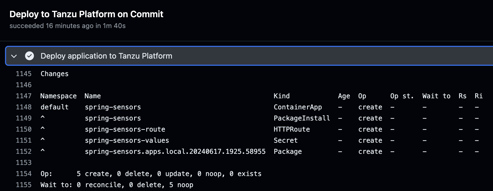
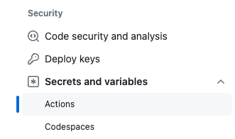

# Tanzu Deploy Action for Github Workflows

### About

Github Action to deploy your application to Tanzu Platform for Kubernetes

### Prerequisites

To use this action with your application, you must have the following:

**Tanzu API Token.** Generate a token that the action will use to authenticate with Tanzu Platform. See [How to generate a Tanzu API Token](tanzu-api-token.md).

**ContainerApp configuration.** In the root of your application directory, run `tanzu app init` to generate a default configuration in the `.tanzu/config` subfolder. If you want to deploy other resources with your application, like an `HttpRoute`, add those to the `.tanzu/config` directory. Be sure to commit these resources to Git.

**Container Registry.** Identify a container registry, and associated credentials that the action can use to publish a container image of your application for deployment.

### Create the workflow secrets

You can create your secrets at the repo or organization level for use with your Github Workflow. Here are the steps for creating at the repo level:

* From your source repo, click on Settings, and select Secrets and Variables / Actions

* Using the "New Repository Secret" button, generate secrets with the following names:

**TanzuApiToken**: The API Token that you generated in the Prerequisites 
**RepositoryUsername**: Username credentials for your container registry 
**RepositoryPassword**: Password credentials for your container registry

### Set up the Github Workflow

In the root of your source code repo, create the workflow file `.github/workflows/tanzu-deploy.yaml`. Copy the contents of the [Sample Workflow](sample-workflow.yaml) into this file.

Replace the fields marked `<<ENTER VALUE>>` with your own values:
* `registry:` Enter the DNS name for your container repo (e.g. harbor.mycompany.com)
* `container_registry:` Enter the full name for the location you want to publish your build image (e.g. harbor.mycompany.com/tanzu-platform/my-app)
* `project:` Enter the name of the Tanzu Platform project where you will be publishing [Docs](https://docs.vmware.com/en/VMware-Tanzu-Platform/services/create-manage-apps-tanzu-platform-k8s/getting-started-set-up-infra.html#create-project)
* `space:` Enter the name of the Tanzu Platform space where you will be publishing [Docs](https://docs.vmware.com/en/VMware-Tanzu-Platform/services/create-manage-apps-tanzu-platform-k8s/getting-started-create-app-envmt.html#create-a-space-in-your-project)

### Run the workflow

Commit your changes to Github. This will trigger a run of the workflow. You can track progress of the workflow under the Actions tab of your repo.
