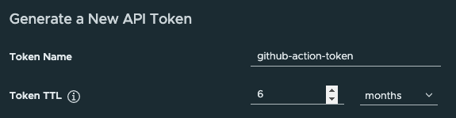
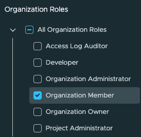
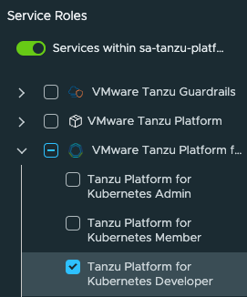

# How to Generate a Tanzu API Token

* Log into https://console.cloud.vmware.com/ and switch to the CSP Organization where you are using Tanzu Platform

* Visit https://console.cloud.vmware.com/csp/gateway/portal/#/user/tokens and click on the "Generate Token Button"

* Enter a token name and TTL

* Under scopes, select "Organization Member" and "Tanzu Platform for Kubernetes Developer"

* Click "Generate", and save the token value. We will be using it to configure the Github Workflow.

[<< Back to Docs](README.md)